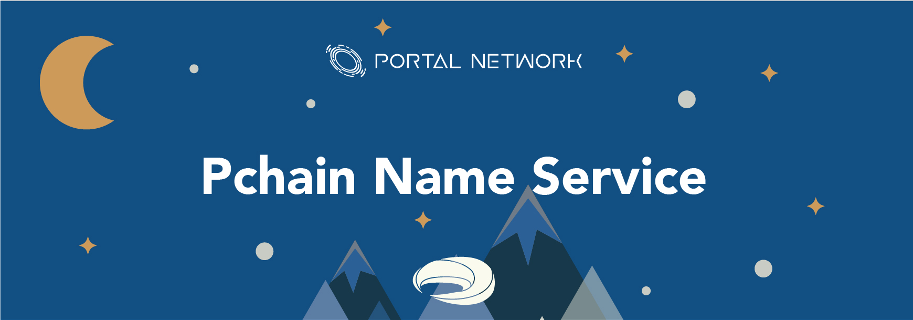
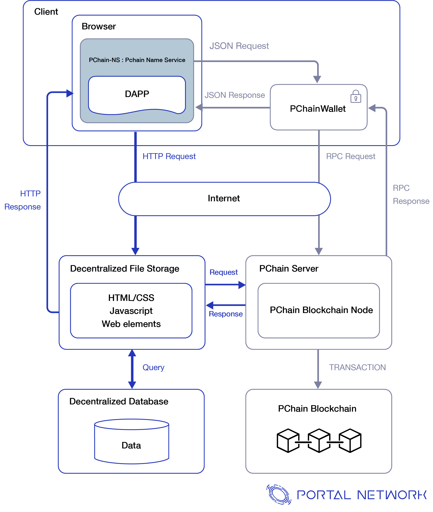
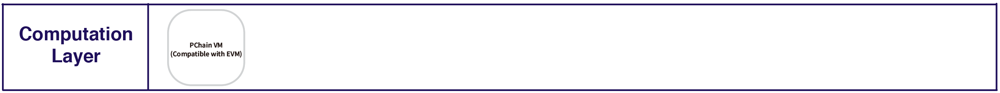
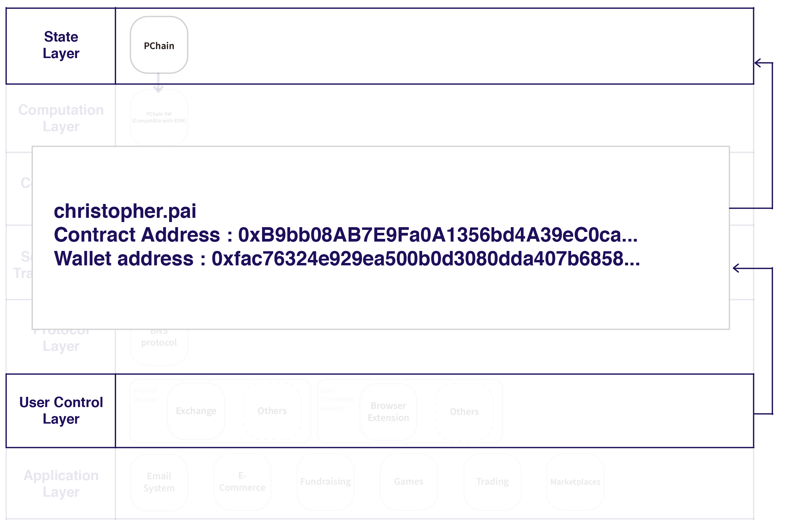

# Pchain Name Service

> 📖🔍 Documents of the Pchain Name Service.

## 💡 What is Pchain?
The first native multichain system that supports EVM in the world and making large scale blockchain applications possible.

## 📚 Documents

#### Table of Contents
- [Introduction](./docs/INTRODUCTION.md)

## Pchain Web3.0
Pchain Name Service plays an connecting and entry layer in Web3.0 services. It connects with Pchain wallet, blockchain server, decentralized content resources, and decentralized database. 

## Pchain Technical Stack

## 🔗 Links
- [Official Website](https://pchain.org/)
- [Whitepaper](https://pchain.org/js/generic/web/viewer.html)
- [Testnet](https://testnet.pchain.org/)

## 📣 Contributing
See [CONTRIBUTING.md](./CONTRIBUTING.md) for how to help out.

## 🗒 Licence
See [LICENSE](./LICENSE) for details.
